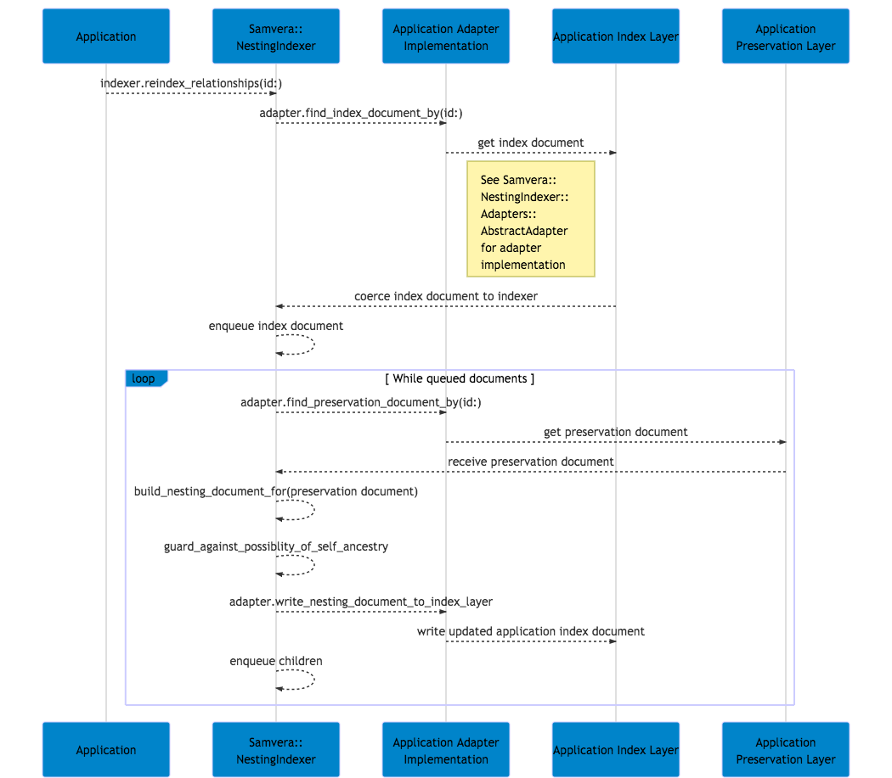

# Samvera::NestingIndexer

[](https://travis-ci.org/samvera-labs/samvera-nesting_indexer)
[](https://codeclimate.com/github/samvera-labs/samvera-nesting_indexer)
[](https://codeclimate.com/github/samvera-labs/samvera-nesting_indexer)
[](http://inch-ci.org/github/samvera-labs/samvera-nesting_indexer)
[](./LICENSE)

The Samvera::NestingIndexer gem generates the graph related attributes related to querying lineage of objects. It maps a PreservationDocument (e.g. a Fedora object) to an IndexDocument (e.g. a SOLR document) by mapping a PreservationDocument's direct parents to ancestral paths for the given PreservationDocument.

* [Background](#background)
* [Concepts](#concepts)
* [Examples](#examples)
* [Adapters](#adapters)
* [Considerations](#considerations)
* [Public API for Semantic Versioning](#public_api_for_semantic_versioning)
* [Installation](#installation)

## Background

This gem began as a sandbox to work through the reindexing strategy for [CurateND Collections](https://github.com/ndlib/curate_nd/issues/420). This gem separates the logic of walking a graph, building the attributes necessary for nested collection maintenance, and persistence concerns. In other words, testing this gem does not require spinning up expensive persistence layers (e.g. SOLR, Fedora, or even an RDBMS).

### Notation

When B is a member of A, I am using the `A ={ B` notation. When C is a member of B and B is a member of A, I'll chain these together `A ={ B ={ C`.

## Concepts

While indexing objects, we work with two types of documents:

1. [PreservationDocument](./lib/samvera/nesting_indexer/documents.rb) - a light-weight representation of a Fedora object
2. [IndexDocument](./lib/samvera/nesting_indexer/documents.rb) - a light-weight representation of a SOLR document object

The four attributes to consider for indexing the graph:

1. id - the unique identifier for a document
2. parent_ids - the ids for of the parents of the given document
3. pathnames - the paths to traverse from a root document to the given document
4. ancestors - the pathnames to each ancestral node of the given node (e.g. pathname to my parent, pathname to my grandparent)

See [Samvera::NestingIndexer::Documents::IndexDocument](./lib/samvera/nesting_indexer/documents.rb) for further discussion.

To reindex a single document, use the [`Samvera::NestingIndexer.reindex_relationships`](./lib/samvera/nesting_indexer.rb) method.

To reindex all documents, use the [`Samvera::NestingIndexer.reindex_all!`](lib/samvera/nesting_indexer.rb) method. **Warning: This is a very slow process.**

From a node's pathname(s), you can query all of that node's descendants (both direct and indirect).

## Examples

Given the following PreservationDocuments:

| PID | Parents |
|-----|---------|
| A   | -       |
| B   | -       |
| C   | A       |
| D   | A, B    |
| E   | C       |
| F   | D       |

When we reindex the above PreservationDocuments, then we will get the following IndexDocuments:

| PID | Parents | Pathnames      | Ancestors        |
|-----|---------|----------------|------------------|
| A   | -       | [A]            | []               |
| B   | -       | [B]            | []               |
| C   | A       | [A/C]          | [A]              |
| D   | A, B    | [A/D, B/D]     | [A, B]           |
| E   | C       | [A/C/E]        | [A, A/C]         |
| F   | D       | [A/D/F, B/D/F] | [A, A/D, B, B/D] |

For more scenarios, look at the [Reindex PID and Descendants specs](./spec/features/reindex_id_and_descendants_spec.rb).

* Given I want to find the direct descendants of A, then I can query all nodes with that have a parent of A.
* Given I want to find the direct and indirect descendants of A, then I can query all notes that have an ancestor entry of A.

## Adapters

An [AbstractAdapter](./lib/samvera/nesting_indexer/adapters/abstract_adapter.rb) provides the method interface for others to build against.

The [InMemory adapter](./lib/samvera/nesting_indexer/adapters/in_memory_adapter.rb) is a reference implementation (and used to ease testing overhead).

CurateND has implemented the [following adapter](https://github.com/ndlib/samvera_nd/blob/master/lib/samvera/library_collection_indexing_adapter.rb) for its LibraryCollection indexing.

To define the adapter for your application:

```ruby
# In an application initializer (e.g. config/samvera_indexer_config.rb)
Samvera::NestingIndexer.configure do |config|
  config.adapter = MyCustomAdapter
end
```

To best ensure you have implemented the adapter to spec:

```ruby
# In the spec for MyCustomAdapter
require 'samvera/nesting_indexer/adapters/interface_behavior_spec'
RSpec.describe MyCustomAdapter
  it_behaves_like 'a Samvera::NestingIndexer::Adapter'
  # Your implementation details here
end
```

[See CurateND for Notre Dame's adaptor configuration](https://github.com/ndlib/samvera_nd/blob/6fbe79c9725c0f8b4641981044ec250c5163053b/config/initializers/samvera_config.rb#L32-L35).

### Sequence Diagram for Reindexing a Single Document

The following sequence diagram documents the interactions in [Samvera::NestingIndexer::RelationshipReindexer](lib/samvera/nesting_indexer/relationship_reindexer.rb).



See [the text-based version of Reindex Relationship diagram](documentation/reindex_relationship.mermaid), leveraging the [Mermaid syntax](https://mermaidjs.github.io).

See [documentation/README.md](documentation/README.md) for details on updating the diagram.

## Considerations

Given a single object A, when we reindex A, we:

* Find the parent objects of A to calculate the ancestors and pathnames
* Iterate through each descendant, in a breadth-first process, to reindex it (and each descendant's descendants).

This is a potentially time consumptive process and should not be run within the request cycle.

### Cycle Detections

When dealing with nested graphs, there is a danger of creating an cycle (e.g. `A ={ B ={ A`). Samvera::NestingIndexer implements two guards to short-circuit the indexing of cyclic graphs:

* Enforcing a maximum nesting depth of the graph
* Checking that an object is not its own ancestor (`Samvera::NestingIndexer::RelationshipReindexer#guard_against_possiblity_of_self_ancestry`)

The [`./spec/features/reindex_pid_and_descendants_spec.rb`](spec/features/reindex_pid_and_descendants_spec.rb) contains examples of behavior.

**NOTE: These guards to prevent indexing cyclic graphs do not prevent the underlying preservation document from creating its own cyclic graph.**

#### Detecting Possible Cycles Before Indexing

Given an up to date index and a document, then it is valid to nest the given document beneath any document that:

* Is not the given document
* Does not have one or more pathnames that includes the given document's ID

For examples of determining if we can nest a document within another document, see the [demonstration of nesting](./spec/features/demonstrating_nesting_spec.rb).

In implementations, you'll likely want to write queries that answer:

* Find the valid IDs that I can nest within?
* Find the valid IDs in which I can nest within and am not already nested within?

## Public API for Semantic Versioning

Any method with `@api public` documentation is part of the semantically versioned API. This means you can assume:

* the method will exist with the same effective signature (perhaps with changes to defaults)
* the method can be called by upstream consumers
* deprecations will be announced prior to major version upgrades

Any module or class with `@api public` documentation is part of the semantically versioned API. This means you can assume:

* the module or class can be accessed upstream
* all public methods are assumed to be `@api public` unless otherwise stated
* deprecations will be announced prior to major version upgrades

## Installation

Add the following to your Gemfile:

```ruby
gem 'samvera-nesting_indexer'
```

Bundle up your gems (e.g. `bundle`).

Then run `rails generator install samvera:nesting_indexer:install`.

## TODO

- [X] Incorporate additional logging
- [ ] Build methods to allow for fanning out the reindexing. At present, when we reindex a node and its "children", we run that entire process within a single context. Likewise, we run a single process when reindexing EVERYTHING.
- [ ] Promote from [samvera-labs](https://github.com/samvera-labs) to [samvera](https://github.com/samvera) via the [promotion process](http://samvera-labs.github.io/promotion.html).
- [ ] Write adapter method to assist in guarding against self-ancestry. We could probably expose a base adapter that has the method through use of the other adapter methods.
- [ ] Add templates to generate the configuration
